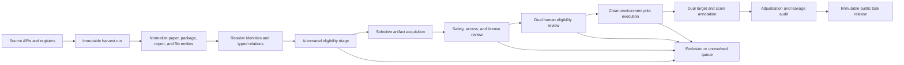

# REPRO-Bench data curation pipeline

Status: implementation design  
Version: 1.0  
Date: 2026-08-21

## 1. Decision summary

The listed catalogs should be treated as a **candidate-discovery graph**, not as
11 interchangeable sources of finished benchmark tasks.

A benchmark task is the verified join of four different things:

1. an original social-science paper;
2. one exact release of the authors' public reproduction package;
3. a credible, public, expert reproduction assessment;
4. the figures, tables, or textual claims that the assessment actually checked.

These must remain separate entities. In particular:

- a Dataverse, ICPSR, or Zenodo dataset DOI is usually a **package DOI**, not the
  article DOI;
- an author package is not evidence that an independent expert reproduced it;
- a CODECHECK certificate or JCRE article is an assessment, not automatically
  the authors' original package;
- reports, certificates, reproduced outputs, and labels are curator-only gold
  evidence and must never leak into the agent-visible task.

The recommended lifecycle is:



This design preserves the realism of REPRO-Bench while adding the provenance,
versioning, finding-level evidence, and release hygiene missing from the current
benchmark release.

## 2. What REPRO-Bench implies for curation

REPRO-Bench defines one paper as one task. The agent receives the paper PDF,
the reproduction package, and a curator-supplied target list. A public expert
report is used to select targets and assign the hidden 1-4 score, but is not an
agent input.

The paper's universal eligibility rules are retained as versioned gates:

| Gate | Requirement |
|---|---|
| C1 | The original paper is social-science research. |
| C2 | The original paper has a valid DOI. |
| C3 | The correct reproduction package is publicly available. |
| C4 | A credible public expert report thoroughly investigates reproduced results. |
| C5 | The README or report explicitly states that target reproduction takes less than two hours. |

The curation system should add four operational gates:

| Gate | Requirement |
|---|---|
| C6 | Essential artifacts can legally and technically be redistributed or deterministically re-fetched. |
| C7 | The exact package release can be executed safely in a clean, documented environment. |
| C8 | The report supports structured target-level evidence and an adjudicable label. |
| C9 | The agent-visible bundle contains no report, certificate, gold output, or answer-bearing derivative. |

Do not force a scientific score when execution is blocked by access, licensing,
environment, or curator error. Such cases remain `blocked` or `excluded` with a
reason code; they are not score 1.

### Important release inconsistencies to fix before reuse

The current local REPRO-Bench materials demonstrate why automated invariants
are necessary:

- the paper reports score counts `20 / 36 / 8 / 48`, while the released
  `ground_truth.json` currently yields `20 / 35 / 9 / 48` after excluding its
  header pseudo-record;
- the ground-truth values are strings and the file contains a header row as
  data;
- the paper's programming-language counts sum to 107, not 112, because no
  explicit unknown/other category is reported;
- the released dataset has unresolved Git LFS pointers and one task uses
  `replication-package/` instead of `replication_package/`;
- task IDs are not mapped to paper DOI, package version, report, source record,
  or artifact hashes.

A new pipeline must fail closed on every one of these conditions.

## 3. Source registry and role assignment

Counts are observations, not constants. Store the upstream-reported total,
query, filters, and timestamp in every harvest manifest. The 2026-08-21 snapshot
is also recorded in `config/source_registry.json`.

| Source | Observed records | Primary role | Readiness and connector strategy |
|---|---:|---|---|
| World Bank RRR | 556 | mixed package + verification report | Keep `reference_id`/`idno` as the package-family key. Use the public catalog API plus related-materials page. Resolve the original paper DOI separately. Review report independence, restricted inputs, runtime, and record-specific license. |
| Political Analysis | 626 | author package | Treat as Harvard Dataverse collection alias `pan`. Use Search API, then pin the discovered published Native API version and its complete file inventory. An editorial policy or note is not automatically a public expert report. |
| CODECHECK | 117 | independent assessment registry | Certificate ID is the assessment key. Preserve separate paper DOI, report DOI, and repository revision. Filter for social science, adequate check scope, original-author package availability, and runtime. |
| JCRE/IREE | 62 | replication/comment study, sometimes package | JCRE article DOI identifies the replication study; JDA/DataCite DOI identifies its package. Resolve the original paper and original author package as separate entities. Classify reproduction versus new-data replication or comment. |
| Harvard Dataverse AJPS | 833 | author package | Reuse one generic Dataverse connector with alias `ajps`. The dataset DOI is the package key; prefer structured related-publication DOI for the paper. Collection membership is not independent assessment evidence. |
| Yale ISPS Dataverse | 147 | broad institutional repository | Add a Dataverse profile for host `dataverse.yale.edu`, alias `isps`. It is not replication-only: prefilter on explicit paper relation, replication materials, code/documentation, and public access. |
| AEA / ICPSR | 6,058 under the current published AEA query | author package | Metadata-first. Request the official Metadata Object-Export API for production bulk access. Do not automate or bypass Cloudflare challenges. Put authenticated/terms-controlled downloads in a manual acquisition queue. |
| Economic Journal Zenodo | 564 | author package | Use the Zenodo community records API; freeze exact version record ID/DOI and group versions by concept DOI. |
| ReStud Zenodo | 524 | author package | Same shared Zenodo connector with community profile `restud-replication`. |
| Econometric Society Zenodo | 267 | author package | Same shared Zenodo connector with community profile `es-replication-repository`. |
| JEEA Zenodo | 144 | author package | Same shared Zenodo connector with community profile `jeea_replication`. |

The 6,058 AEA count differs from the stated 6,078 because the current collector's
query is filtered to published records in the AEA archive. Record both numbers
and the exact query rather than silently choosing one. The undeduplicated source
total in this snapshot is 9,898; it is not an estimate of eligible tasks.

### Current workspace readiness

- Seven collectors exist; Yale ISPS is the only listed source without a local
  connector or example.
- All 166 existing offline connector tests pass. They test HTTP behavior,
  parsing, normalization, rate limiting, safe paths, cache/resume, and download
  integrity. They do not test paper identity, C1-C9 eligibility, independent
  assessment quality, target annotation, scoring, or leakage.
- Most checked-in local catalogs are bounded smoke runs. They must not be
  interpreted as full source inventories.
- Reused output trees already contain stale per-record directories not present
  in their current catalog (AJPS and Economic Journal examples). This is why an
  immutable run catalog, rather than directory enumeration, must be authoritative.
- Paper linkage is sparse outside CODECHECK, and license coverage is incomplete.
  Identity and rights review are first-class queues, not optional enrichment.
- Generated outputs are gitignored, so durable fixtures and run manifests must
  be selected explicitly for reproducible integration tests.

### Recommended harvesting methods

- **Dataverse (PAN, AJPS, Yale ISPS):** parameterize one engine by host,
  collection alias, delay, and output location. Discover via Search API. Pin the
  exact published dataset version before reading files. Preserve dataset DOI,
  version, file IDs, directory labels, restriction status, checksums, license,
  terms of use, and terms of access. Download only unrestricted files from exact
  Data Access API URLs.
- **Zenodo:** use one engine and data-only community profiles. Store both concept
  and version identifiers. Default discovery may show latest versions only, but
  the curated task must freeze the selected version and every file checksum.
- **World Bank:** retain raw API responses and related-materials HTML because the
  main metadata response does not contain the complete attachment/report role
  inventory. Never infer the article DOI from a package DOI.
- **CODECHECK:** conditionally fetch the static register, then the certificate
  JSON. Resolve linked repositories only after triage. Preserve the exact commit
  or immutable record version and the manifest of outputs checked.
- **JCRE:** parse the publication index, normalize malformed DOI links, and enrich
  JCRE/JDA DOIs through DataCite. A JCRE package normally belongs to the
  replication article, so it must not be substituted for the original authors'
  package.
- **AEA/ICPSR:** keep public search metadata collection separate from file
  acquisition. Use the official bulk API or a documented manual-authenticated
  workflow. Challenge solving is not a connector feature.

## 4. Storage layers and immutable runs

Use four physical stores with different permissions:

```text
curation/
├── runs/<run_id>/
│   ├── run_manifest.json
│   ├── raw/<source>/...                 # exact responses and headers
│   ├── normalized/<source>.jsonl        # connector output for this run only
│   ├── errors/<source>.jsonl
│   └── qa/report.json
├── catalog/
│   ├── papers.parquet
│   ├── artifact_releases.parquet
│   ├── assessments.parquet
│   ├── relations.parquet
│   ├── candidates.parquet
│   └── findings.parquet
├── private/                             # access controlled
│   ├── gold/<candidate_id>/assessment.json
│   ├── reports/<sha256>
│   └── execution/<candidate_id>/...
└── releases/<release_id>/
    ├── manifest.json
    ├── tasks/<task_id>/...
    └── exclusions.jsonl

blobs/sha256/<first-two>/<sha256>         # content-addressed binary store
```

Rules:

1. Never reuse a mutable output directory for a new crawl. A run ID should be
   UTC timestamp plus a hash of the canonical run parameters.
2. `catalog.json` or the normalized JSONL for that run is authoritative. Files
   left in a directory by an older run do not count as records.
3. Save request URL, canonical query, response timestamp, status, ETag,
   Last-Modified, response SHA-256, pagination cursor, and upstream total.
4. A bounded or failed run is always marked `complete: false`; it cannot be
   promoted to the canonical inventory.
5. Binary files are stored once by SHA-256. Source-specific paths are manifest
   references, not duplicate copies.
6. Reports and gold evidence live under `private/`; public task exporters cannot
   read that tree under their normal credentials.

The existing connectors already implement much of the raw caching, exact-link
download, checksumming, resume, and error logging. The missing component is the
shared, immutable integration layer above them.

## 5. Canonical graph model

Do not flatten every source into a single source-shaped row. Normalize these
entities and connect them with typed, evidenced relations.

### 5.1 `Paper`

- canonical paper ID;
- normalized bare article DOI and any other identifiers;
- title, authors/ORCIDs, venue, publication dates, discipline evidence;
- canonical landing page and paper PDF artifact;
- first-public timestamp and provenance for every resolved field.

### 5.2 `ArtifactRelease`

- role: `paper_pdf`, `author_package`, `readme`, `code`, `data`, `environment`,
  `expected_output`, `reproduction_report`, `certificate`, or `other`;
- persistent identifier and platform-specific family/version keys;
- exact version/revision, source URL, retrieval timestamp, size, media type,
  SHA-256, upstream checksum, and raw metadata reference;
- access state, restriction/embargo/guestbook status, license, terms, and
  redistribution decision;
- visibility: `agent_visible` or `curator_only`.

`reproduction_report` and `certificate` artifacts are always curator-only.

### 5.3 `Assessment`

- assessment/report DOI or stable registry ID;
- authors, affiliations, date, assessment organization, and conflict review;
- scope: outputs inspected, execution depth, original versus corrected code,
  and whether new data were introduced;
- credibility evidence and public report artifact;
- relation to the exact paper and package release.

### 5.4 `Relation`

Use predicates such as:

- `describes`;
- `is_version_of`;
- `supplements`;
- `authored_package_for`;
- `assesses`;
- `checks_release`;
- `replicates_with_new_data`;
- `replies_to`;
- `contains`;
- `produces`.

Every relation includes evidence type, evidence source, confidence, resolver
version, and human review state. A relation found only through title similarity
is a review candidate, not a fact.

### 5.5 `Candidate`, `Finding`, `Review`, and `ExecutionAttempt`

- `Candidate` stores workflow state and C1-C9 decisions, not source metadata.
- `Finding` stores one report-checked figure, table, or verbatim textual claim.
- `Review` preserves independent decisions, disagreement, adjudication, and
  reviewer/time provenance.
- `ExecutionAttempt` records environment digest, commands, runtime/resources,
  network policy, logs, patches, outputs, and failure classification.

The machine-readable contracts are in:

- `schemas/candidate.schema.json`;
- `schemas/assessment.schema.json`;
- `schemas/task-manifest.schema.json`.

## 6. Source-to-canonical mapping

| Source output | Paper identity | Package release | Assessment/report | File inventory |
|---|---|---|---|---|
| World Bank | `paper.outputs[]` plus later DOI resolution | `reference_id`, `package_doi`, package resource | verification-report resource | `resources[]` |
| Political Analysis | structured publication DOI if present; otherwise unresolved | Dataverse `persistent_id` + pinned version | none implied | `files[]` |
| CODECHECK | `paper.reference_url` DOI | `repository` + immutable revision | `certificate_id`, `report.url` | `artifacts[]` and provider inventory |
| JCRE | original cited paper must be separately resolved | original authors' package must be separately resolved | `article_doi`; `replication.doi` is normally the replication article's package | `replication.resources[]` |
| AJPS | `paper.identifier` or structured related publication | `persistent_id` + `version.number` | none implied | `hosted_files[]` |
| Yale ISPS | structured related publication | dataset DOI + explicit version | none implied | Native API file manifest |
| AEA/ICPSR | related-publication DOI from bibliography/metadata | `study_id` family + exact `version`/package DOI | policy review is not automatically public assessment | `resources[]` |
| Zenodo communities | `related_identifiers` with paper-like relation | concept DOI family + exact record/version DOI | none implied | `hosted_files[]` |

No current connector field should be renamed in place. Add deterministic
normalizer adapters so source crawlers can evolve independently.

## 7. Entity resolution and deduplication

### 7.1 DOI normalization

For every DOI-like value:

1. trim whitespace and Unicode lookalikes;
2. remove `doi:`, `https://doi.org/`, `http://dx.doi.org/`, query strings, and
   trailing citation punctuation;
3. percent-decode once and lowercase;
4. validate the DOI grammar and resolve it with bounded retries;
5. store the original value, normalized value, resolver status, and timestamp.

Never promote a package DOI to the paper DOI because its title resembles the
article title.

### 7.2 Platform family keys

- Zenodo: concept DOI/record ID is the family; record DOI/ID is the immutable
  release.
- Dataverse: dataset DOI is the family; `major.minor` is the release.
- ICPSR: base project number is the family; `Vn`/version DOI is the release.
- World Bank: `reference_id`/`idno` is the family; preserve any explicit version.
- CODECHECK: certificate ID is the assessment identity; linked repository
  revision and report DOI remain separate.
- JCRE: JCRE article DOI, JDA package DOI, original article DOI, and original
  author-package identifier are four potentially different identities.

### 7.3 Matching policy

Auto-link only on one of the following:

- equal normalized persistent identifiers with compatible entity types;
- an explicit typed relation from trusted source metadata;
- an assessment registry's explicit paper/package reference that resolves to
  the same immutable object.

Title + first author + year, title embeddings, or fuzzy citations only create a
human review queue. Preserve separate packages that target the same paper; they
may be different releases or independent reproduction attempts.

Deterministic candidate IDs should be UUIDv5 values derived from the normalized
paper DOI. Before the paper DOI is known, use a source-scoped provisional ID and
replace it through an audited alias record rather than mutating history.

## 8. Automated triage and queues

Run cheap metadata checks before downloading multi-gigabyte packages.

### High-priority queue

A record enters `eligibility_review` when it has:

- a resolved original paper DOI and social-science evidence;
- an explicit link to a public, exact author-package release;
- an explicit public assessment/report link;
- enough report metadata to evaluate credibility and scope;
- a runtime statement or a promising runtime estimate;
- no known essential restricted input.

World Bank records with verification reports, appropriate CODECHECK records,
and some JCRE relationships should be screened first.

### Package-match queue

PAN, AJPS, Yale, AEA, and Zenodo records with a strong paper link but no public
assessment remain useful. Join them to independent reports discovered in
CODECHECK, JCRE, World Bank, I4R, or another approved assessment source. They do
not enter benchmark annotation until C4 is satisfied.

### Manual identity queue

Records with only a prose citation or title/author/year match require a curator
to confirm the article DOI and exact package relationship.

### Exclusion and blocked queues

Use stable reason codes, including:

- `not_social_science`;
- `paper_doi_missing_or_invalid`;
- `author_package_missing`;
- `package_relation_unverified`;
- `expert_report_missing`;
- `report_not_independent`;
- `report_scope_insufficient`;
- `new_data_replication_only`;
- `essential_data_restricted`;
- `license_or_terms_block_release`;
- `runtime_over_limit`;
- `runtime_not_evidenced`;
- `unsafe_or_malicious_package`;
- `environment_unavailable`;
- `gold_not_adjudicable`;
- `answer_leakage_unremovable`;
- `duplicate_candidate`.

An uncertain decision is not a failure. Keep `pass`, `fail`, `uncertain`, and
`not_applicable` distinct.

## 9. Selective download, safety, and licensing

### 9.1 Metadata-first budgeting

Before download, calculate per-source and per-candidate known bytes, unknown-size
files, restricted files, and projected extracted size. Approve download batches
against a disk and review budget. Start with README, report, paper, manifest, and
small code files before large raw data when the source permits file-level access.

### 9.2 Safe acquisition

- Use only exact upstream URLs or documented API links.
- Stream to a partial file, enforce advertised and actual byte limits, verify
  checksum/size, then atomically promote to the content-addressed store.
- Quarantine archives before extraction. Reject path traversal, absolute paths,
  device files, unsafe symlinks, extreme compression ratios, and excessive
  nesting/file counts.
- Scan for secrets and malware indicators. Ingestion never executes package code.
- Record redirects without persisting temporary signed query strings.

### 9.3 License decision

Store metadata license, file/package license, paper/report license, terms of use,
and access conditions separately. Repository metadata licensing does not grant
rights to linked packages. A curator records one of:

- `redistribute`;
- `redistribute_with_attribution`;
- `reference_only_refetch`;
- `restricted_internal_only`;
- `unknown_needs_review`;
- `exclude`.

Every release includes per-artifact attribution and license/terms provenance.

## 10. Human curation protocol

### 10.1 Eligibility review

Two curators independently assess C1-C9 from the paper, package metadata,
README, and report. They do not see each other's decision before submission.
Disagreements are adjudicated by a third qualified reviewer. Preserve all three
records; do not overwrite the initial judgments.

C4 should be evaluated explicitly:

- Is the full report public, rather than only a badge or editorial assertion?
- Are the assessors qualified for the domain and methods?
- Is the assessment independent of the original authors, or is any conflict
  documented?
- Did it run/inspect the relevant analysis instead of merely checking that files
  exist?
- Does it compare outputs with the paper and explain discrepancies?
- Can its claims be traced to stable report locations and artifacts?

### 10.2 Target annotation

The report defines scope. Annotate every paper figure, table, or inline claim
that the report actually reproduced. Each target stores:

- stable finding ID and type;
- exact paper label or verbatim text claim;
- paper page/section/table/figure locator;
- report page/section/output locator;
- producing scripts/functions and required inputs;
- expected output paths;
- numeric, textual, or visual comparison procedure and tolerance;
- report-stated outcome, issue locus, and severity;
- independent reviewer decisions and adjudication.

Structured findings are primary. Generate legacy `should_reproduce.txt` only as
an export adapter.

### 10.3 Scoring rubric

Version the rubric and keep finding outcomes separate from the paper score:

- **1:** one or more major target findings are substantively irreproducible after
  correct setup, or the report establishes a major analysis error affecting them;
- **2:** code and/or data contain a verified inconsistency or error, but the
  targeted major findings remain substantively unchanged;
- **3:** analysis and calculations are correct, with only display/reporting-level
  discrepancies such as rounding or formatting;
- **4:** all targeted major findings are fully reproducible and no qualifying
  inconsistency is established.

Also record `scientific_outcome`, `execution_outcome`, and `task_packaging_outcome`
separately. Environment failure, blocked access, and malformed output paths are
not scientific labels.

## 11. Clean-environment execution validation

Every eligible candidate receives at least two independent successful curator
runs from a clean environment before release.

The runner must use:

- a disposable VM/container with no host secrets;
- read-only input and a separate writable work directory;
- CPU, RAM, disk, process, and wall-clock limits;
- network disabled by default or allowlisted only for declared public inputs;
- pinned OS/container digest and package-lock/environment snapshots;
- licensed Stata/MATLAB runners where required;
- complete command, stdout/stderr, Stata log, file tree, output hash, and resource
  telemetry capture.

Track modifications in three classes:

1. `none`: original package runs as published;
2. `portability_patch`: paths, directory creation, or dependency/environment
   repair without changing analysis logic;
3. `analysis_patch`: changes scientific code or data logic.

Store patches and both pre/post hashes. An analysis patch cannot silently become
part of the agent-visible author package. It is curator evidence for the label.

REPRO-Bench's observed failure modes should become explicit tests: output
comparison errors, Stata errors hidden in log files, library installation
failures, and misplaced files or directories.

## 12. Leakage and contamination control

Before packaging, compare every agent-visible file against curator-only report,
certificate, gold outputs, target manifest, and answer strings.

The leakage audit must detect:

- report/certificate files embedded in a package archive;
- reproduced outputs or filenames that state the assessment conclusion;
- README text added by a verifier rather than the original authors;
- hidden gold JSON or score strings;
- repository commits created by the reproducer instead of the authors;
- duplicates of evaluation tasks in other splits or sources.

Prefer retrieving the original author package over deleting files from a
verifier repository. Sanitizing a verifier package can change the scientific
task and leave subtle answer evidence behind.

For model-contamination analysis, record separate timestamps for:

- paper first publication;
- package release and each revision;
- report release and each revision;
- first public availability of the exact task bundle;
- curation retrieval and benchmark release.

Do not use a source record's `updated_at` as proof that the scientific content is
post-cutoff. Keep a naturalistic benchmark and a stricter post-cutoff slice.

## 13. Public task and private gold exports

Agent-visible task:

```text
<task_id>/
├── paper.pdf
├── replication_package/
├── targets.json
├── should_reproduce.txt       # generated compatibility view
├── task_manifest.json
└── LICENSES/
```

Curator-only gold:

```text
private/gold/<task_id>/
├── assessment.json
├── report/
├── source_snapshots/
├── executions/
├── patches/
├── adjudication/
└── expected_outputs/
```

The task manifest contains only public provenance, exact agent-visible hashes,
environment requirements, resource limits, and structured targets. It never
contains report URLs, report locators, finding outcomes, reviewer notes, or the
paper-level score.

## 14. Splitting and sampling

Maintain two products:

1. **candidate inventory:** complete, prevalence-preserving, and updated by
   immutable snapshots;
2. **benchmark releases:** frozen, quality-gated samples with declared sampling
   and class distributions.

Group all versions and cross-source instances of one paper in the same split.
Also group duplicate package families and near-identical assessment families.
Stratify benchmark sampling across:

- score and finding-level issue type;
- source and journal;
- publication/report period;
- R, Stata, Python, MATLAB, Julia, other, no-code, and multi-language workflows;
- single/multiple data formats;
- package size, file count, runtime, and dependency complexity;
- public versus restricted/non-redistributable attrition;
- report organization and assessment method.

Do not describe a four-class set as balanced merely because scores 1-2 and 3-4
have equal totals. Publish the natural prevalence, selection weights, a
constant-majority baseline, per-class results, macro-F1, balanced accuracy, and
claim-level metrics in addition to exact paper-level accuracy.

## 15. Quality gates and invariants

Promotion to the next layer must be automatic and fail closed.

### Harvest invariants

- run parameters and query hash are present;
- `complete`, truncation, and source total are explicit;
- pagination has no repeated/stalled cursor and unique source IDs equal the
  normalized record count;
- raw response hashes verify;
- no stale filesystem record is included outside the authoritative catalog;
- error and skip counts reconcile with attempted operations.

### Identity and artifact invariants

- paper DOI, package DOI, report DOI, and certificate IDs occupy typed fields;
- one entity type cannot silently replace another;
- every auto-link has persistent-identifier or explicit relation evidence;
- exact release/version/revision and all local hashes are present;
- access and license decisions exist for every released artifact;
- downloaded bytes, file count, and extracted inventory reconcile.

### Annotation invariants

- every final task has at least one adjudicated target;
- every text claim is verbatim and has a paper locator;
- every target has report evidence in the private store;
- every final score is an integer 1-4 and has two independent reviews plus
  adjudication when needed;
- label totals sum to task count and every reported marginal table has explicit
  `unknown/other/not_applicable` categories.

### Release invariants

- all expected files are materialized, not Git LFS pointer text;
- `replication_package/` exists with the exact required name;
- public hashes match the curated manifest;
- no curator-only artifact or answer-bearing content appears in the public tree;
- two clean reruns agree on the finding-level outcomes;
- tasks from one canonical paper/package family occur in only one split.

## 16. Monitoring metrics

Report these for every source and release:

- harvested, normalized, unresolved, linked, excluded, blocked, and eligible
  counts by gate and reason;
- source-total drift and run completeness;
- paper DOI coverage, exact package-link coverage, public report coverage,
  runtime-evidence coverage, and license-decision coverage;
- auto-link precision from a human-audited sample and manual-review yield;
- download bytes, unknown-size bytes, checksum failures, restricted/embargoed
  files, and stale/changed releases;
- inter-reviewer agreement by gate, finding outcome, and score before
  adjudication;
- execution success, runtime, portability patches, analysis patches, and failure
  classes;
- leakage failures and contamination-slice coverage;
- source and toolchain distribution before and after every gate.

## 17. Recommended implementation sequence

### Phase 0: make collection auditable

1. Keep existing source collectors unchanged behind adapters.
2. Make every top-level run immutable and write one JSON run manifest.
3. Add Yale ISPS as a profile of a shared Dataverse engine.
4. Add explicit `complete`, `max_records`, `source_total`, query, date basis, and
   run hash to every catalog.
5. Add an integration test that rejects stale records and partial runs.

### Phase 1: canonical inventory

1. Implement source adapters into `Paper`, `ArtifactRelease`, `Assessment`, and
   `Relation` tables.
2. Normalize DOI values and platform version families.
3. Generate manual identity queues for unresolved paper links.
4. Produce gate-yield and coverage dashboards before downloading packages.

### Phase 2: near-ready pilot

1. Prioritize World Bank records with verification reports, CODECHECK records
   with adequate scope and original-author packages, and reproducibility-focused
   JCRE records.
2. Select 25-30 candidates spanning R, Stata, Python, and multi-language cases.
3. Run dual eligibility review, license review, clean execution, dual target
   annotation, and adjudication.
4. Release only after the public/private leakage audit passes.

### Phase 3: cross-source joins

1. Match package-rich Dataverse, AEA, and Zenodo records to approved independent
   assessments using exact paper DOI and explicit relations.
2. Request official AEA metadata/bulk-access credentials rather than depending
   on browser challenges.
3. Expand the pilot while monitoring attrition by source and toolchain.

### Phase 4: benchmark releases

1. Freeze a versioned naturalistic inventory.
2. Create group-safe train/dev/test or evaluation-only splits.
3. Publish release manifests, exclusion counts, sampling design, license/terms
   notices, data statements, and baseline metrics.
4. Never mutate a released task; publish a new release with an auditable delta.

## 18. Definition of done for one task

A candidate is benchmark-ready only when all of the following are true:

- C1-C9 are `pass` with evidence and completed human review;
- original paper DOI and PDF are verified;
- the exact original author-package release is frozen and hash-complete;
- an independent expert report is frozen in the private store;
- at least one report-checked finding is independently annotated and
  adjudicated;
- two clean executions agree or the report-supported discrepancy is reproduced;
- environment and runtime are documented and within the declared tier;
- every artifact has an access/license/redistribution decision;
- agent-visible and curator-only bundles are physically separated;
- leakage, family-split, hash, path, and materialization tests pass;
- the integer score and finding outcomes reconcile under a named rubric version.

Anything less remains a valuable catalog record, but not a REPRO-Bench task.
